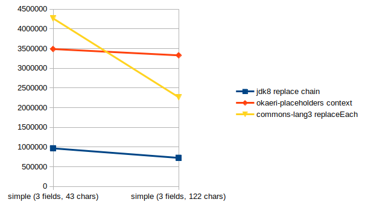
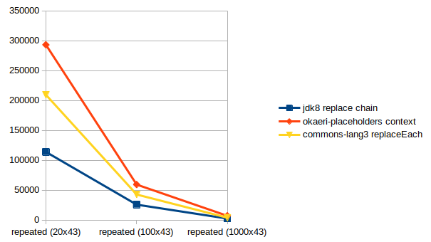
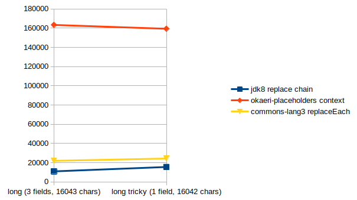
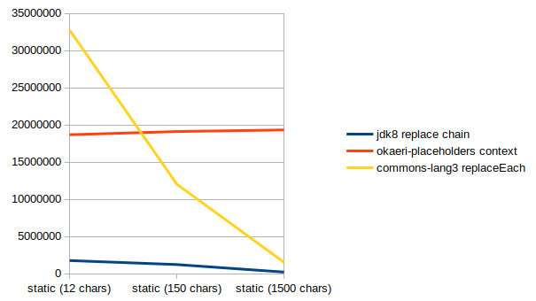

# Okaeri Placeholders (okaeri-placeholders)


[](https://discord.gg/hASN5eX)

Simple blazing-fast placeholders library with yet unlimited capabilities. Part of the [okaeri-platform](https://github.com/OkaeriPoland/okaeri-platform).

## Installation

### Maven

Add repository to the `repositories` section:

```xml
<repository>
    <id>okaeri-repo</id>
    <url>https://storehouse.okaeri.eu/repository/maven-public/</url>
</repository>
```

Add dependency to the `dependencies` section:

```xml
<dependency>
  <groupId>eu.okaeri</groupId>
  <artifactId>okaeri-placeholders-[platform]</artifactId>
  <version>3.0.1</version>
</dependency>
```

### Gradle

Add repository to the `repositories` section:

```groovy
maven { url "https://storehouse.okaeri.eu/repository/maven-public/" }
```

Add dependency to the `maven` section:

```groovy
implementation 'eu.okaeri:okaeri-placeholders-[platform]:3.0.1'
```

## Format

```console
# basic message
Hello World!
# with simple placeholder
Hello {who}!
# with simple placeholder and fallback value
Hello {who|unknown}!
# with subfields
Hello {who.name}!
# with subfields and fallback value
Hello {who.name|unknown}!
# with pluralization for 143 locales (okaeri-pluralize)
I would like {amount} {apple,apples#amount}.
# with boolean translation
Active: {yes,no#status}
# with number formatting
Value: {%.2f#value}
# with duration (e.g. "1d12h", supports precision, see: (h))
Remaining time: {duration(h)}
# with instant (time, datetime, date, pattern - localized - optional timezone)
Time: {ldt,medium,Europe/Paris#time}
```

## Example

Basic example representing standard usage for simple placeholders. For more examples and advanced usage cases
see [tests](https://github.com/OkaeriPoland/okaeri-placeholders/tree/master/core/src/test/java/eu/okaeri/placeholderstest). For subfield support (e.g. {player.name})
see [TestSchema.java](https://github.com/OkaeriPoland/okaeri-placeholders/blob/master/core/src/test/java/eu/okaeri/placeholderstest/schema/TestSchema.java), for pluralization and other metadata
see [TestMetadataUsage.java](https://github.com/OkaeriPoland/okaeri-placeholders/blob/master/core/src/test/java/eu/okaeri/placeholderstest/TestMetadataUsage.java).

```java
// this is intended to be loaded from the configuration on the startup/cached and stored compiled
CompiledMessage message = CompiledMessage.of("Hola {who}! ¿Cómo estás {when}? Estoy {how}.");

// context can be reused (use #create() and #apply(message)) 
// or created on demand (use #of(message) and #apply())
// second version can't be reused but is faster in on-demand scenario
// especially when resulting message is using only part of the placeholders
PlaceholderContext context = PlaceholderContext.of(message)
    .with("who", "Mundo") // in real life scenario these would be your variables
    .with("when", "hoy")
    .with("how", "bien");

// process message and get output: Hola Mundo! ¿Cómo estás hoy? Estoy bien.
String test = context.apply();
```

## Benchmarks

**Note**: Since JDK8 times, the built-in `String#replace(CharSequence, CharSequence)` has become faster or comparable to the `okaeri-placeholders` in some benchmarks,
but even ignoring lacking features, it is and will be always unsafe to use for placeholders due to the sole nature of chaining.

Charts are representing operations per second for each of the implementations. For the current source code of test
see [benchmark](https://github.com/OkaeriPoland/okaeri-placeholders/tree/master/benchmark) directory.

- Okaeri Placeholders benchmark is based on cached CompiledMessage as this is intended use of the library. PlaceholderContext is created every iteration.
- JDK8 String#replace benchmarks are chaining replace calls together, as one may do while implementing this type of system with no additional code.
- CommonsLang3 StringUtils#replaceEach benchmarks are using standard single call with no additional code.
- Spec: (AdoptOpenJDK)(build 1.8.0_282-b08), OS: Ubuntu 20.04.2 LTS x86_64, CPU: AMD Ryzen 5 3600 (12) @ 3.600GHz, okaeri-placeholders: 1.0.0

### Simple

This group represents average messages with fields.



### Repeated

This group uses multiline string built by repeating string from the simple group to check for repeated fields/stress performance.



### Long

This group represents the replacement of a few evenly distributed fields inside a long string, e.g. html e-mail template. The long tricky represents long string with one field in the last 20% of the
string.



### Static

This group shows differences in the performance for static strings that do not require any processing, but nor `String#replace` chain neither `StringUtils#replaceEach` can know that, causing
performance loss when the character count is going up.


